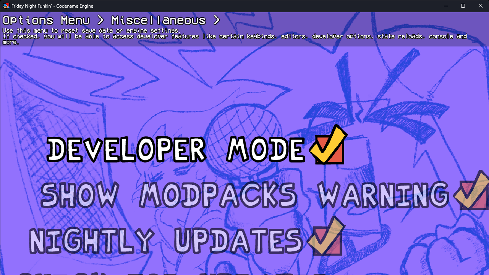
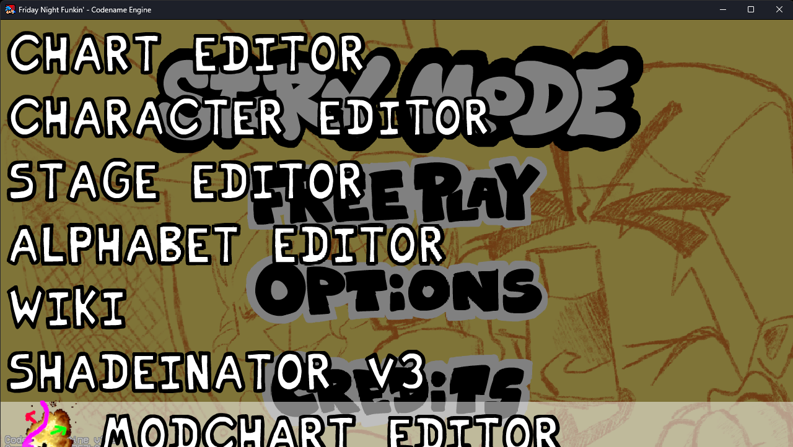
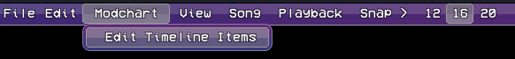

# Cómo descargar

Puedes descargar el proyecto presionando el botón verde Code y luego seleccionando Download ZIP o [dando click aqui](https://github.com/Martincraft7887/modcharteditor-cne-1.0.1/archive/refs/heads/main.zip)

Una vez descargado:

Extrae el archivo .zip
Coloca la carpeta dentro de mods en tu instalación de Codename Engine.

La ruta debería quedar así:

Codename Engine/mods/modcharts

Si deseas incluirlo dentro de tu propio mod, simplemente mueve el contenido de este repositorio a la carpeta mods de tu mod.

# Información adicional

Si no tienes conocimientos básicos de configuración en codename engine, puedes modificar el archivo:

data/config/modpack.ini

Desde ahí puedes:

Cambiar el nombre de la ventana
Modificar el ícono de la aplicación
Cambiar el ícono de Discord RPC

# Cómo usar

Abre Codename Engine
Presiona TAB para seleccionar el mod (si no está activo)
Ve a:
Configuración
Opciones misceláneas
Activa las opciones de desarrollador

Regresa al menú principal
Presiona 7

Selecciona Modchart Editor (se encuentra hasta abajo)
Elige una canción de tu mod y comienza a editar

# Crear Modcharts por dificultad

Si quieres usar un Modchart diferente para cada dificultad:

Ve a la carpeta de la canción:

TuMod/songs/TuCancion/

Ahí encontrarás:

modchart.xml

Renómbralo según la dificultad:

modchart-hard.xml

También puedes crear otros archivos como:

modchart-normal.xml
modchart-easy.xml
modchart-miDificultad.xml

El editor soporta dificultades personalizadas, así que cualquier nombre funcionará mientras coincida con el nombre de la dificultad de la canción.

# Cómo agregar shaders y modificadores

Dentro del editor:

Modchart > Timeline Items

Desde ahí podrás agregar:

- Shaders
- Modificadores de notas
- FunkinModchartModifier

# Carpeta de shaders

Los shaders deben ir en:

shaders/modchart

Los shaders por defecto se encuentran en:

addons/ModchartEditor-PostProcessShader/shaders/modcharts

# Carpeta de modifiers

Los modifiers se encuentran en:

addons/ModchartEditor-GPUNotesModchart/modifiers

Si quieres crear nuevos modifiers, puedes usar como base el shader:

notePerspective

ya que este es el encargado de definir el comportamiento de las notas.
